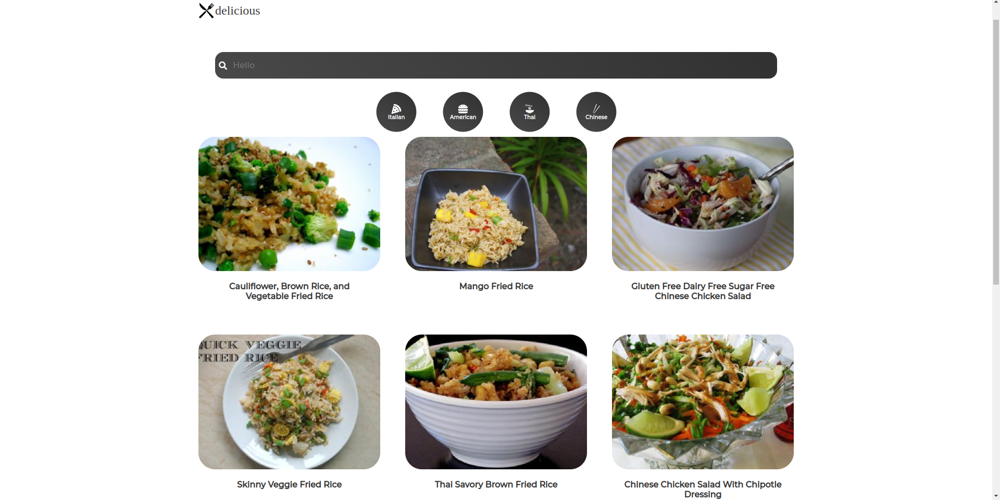

## Screenshots



# Recipes

A simple React project for the purpose of demonstrating my knowledge of creating React components, pages, and network requests.
This project focuses on yummy food recipes from the Spoonacular API.

## Installation

To get started with the recipes, follow these steps:

Clone the repository:

```bash
git clone https://github.com/ZivFisher/recipes.git
```

Navigate to the project directory:

```bash
cd recipes
```

Install dependencies:

```bash
npm install
```

run client:

```bash
npm run start
```
